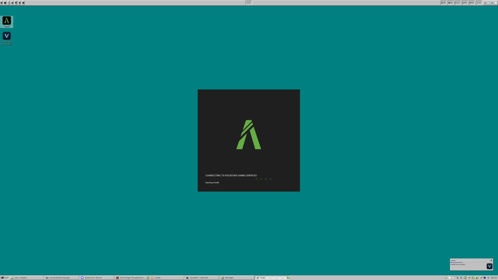
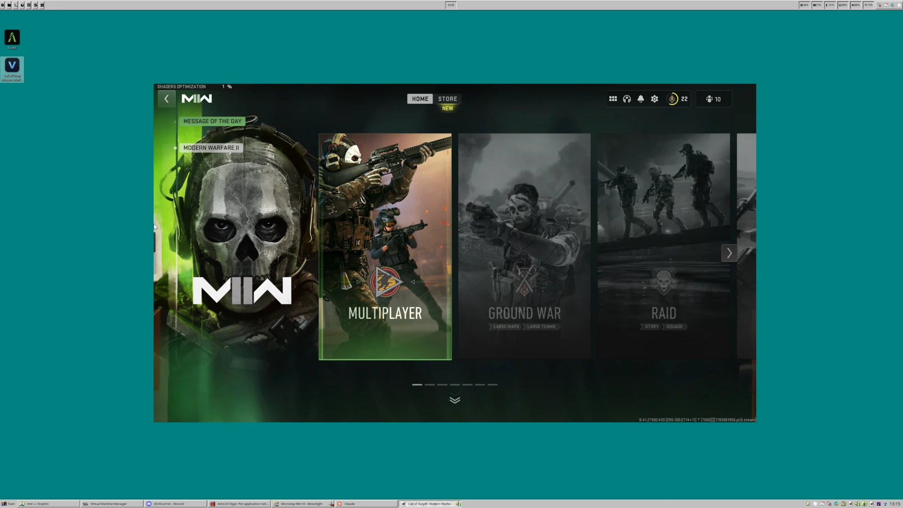

<p align="center">
  
</p>

<h1 align="center">Vypr</h1>

<p align="center">
  Per-application native windows from a Windows VM, over shared memory.
</p>

> [!NOTE]
> **Vypr is in the public domain**, under [the Unlicense](LICENSE). No rights
> reserved — copy it, change it, redistribute it, sell it, with or without
> credit. It comes with no warranty of any kind, express or implied.

An app running in the guest appears as an ordinary window on the Linux desktop —
its own entry in the taskbar, its own place in the stacking order — with no RDP
and no video codec in the path.

## What it is

A Windows application running inside a virtual machine, appearing on your Linux
desktop as an ordinary window. Its own taskbar entry. Its own place in the
stacking order. You alt-tab to it like anything else, and it is a Windows app
the whole time.

No remote desktop, no video encoder, no streaming client to connect to. The
picture goes from the guest's memory to your screen uncompressed.

## Where it came from

This started as a passion project with one goal: **play FiveM on Linux.**

FiveM does not run under Wine, and the usual answers were all unsatisfying. A
whole-desktop stream means alt-tabbing inside someone else's desktop. RDP hands
over individual windows properly, but its video path was built for documents and
falls apart on anything that moves. Running the game on a second machine means
owning a second machine.

What was actually wanted was narrower than any of those: **one window, from the
VM, behaving like a native one.** Vypr is that, and it turned out to work for
anything else in the VM too.

## What it looks like

<details>
<summary><b>FiveM</b> — the application this was built for, running in the VM with its own taskbar entry</summary>

<br>



</details>

<details>
<summary><b>Call of Duty: Modern Warfare II</b> — launched from Steam inside the guest</summary>

<br>



</details>

## What you need

Vypr does not create your VM — it makes an existing one useful. Before
installing, you need:

- a **second GPU** passed through to a Windows VM under libvirt, with IOMMU on
- a Linux desktop with SDL3, CMake, Ninja and a C++ compiler
- Windows 10 1903 or newer in the guest

Both installers check for these and say plainly what is missing rather than
failing halfway through.

## Installing

Two installers, one per side.

**On Linux**, from a clone of this repository:

```bash
./install/install.sh
```

It builds and installs the binaries, configures your VM, generates a key for the
guest, and prints the two commands that need root rather than asking for your
password. It only changes the VM where something is actually missing, and saves
the original settings before it does.

**In Windows**, run `vypr-setup.exe` from the
[latest release](https://github.com/Amzi-01/Vypr/releases/latest) inside the VM.
One file, nothing to unpack: it carries the agent, installs the two drivers Vypr
needs, and authorises the key the Linux installer printed. Windows will ask you
to accept the drivers, which only a person can click.

It can also turn on automatic login, because Vypr needs a logged-in desktop to
capture — a VM sitting at the lock screen has nothing to show. That asks for your
Windows password and uses it once, to write Windows' own auto-login setting.
The installer says so on screen and links to its own source.

## Using it

Register an application once:

```bash
vypr add fivem 'C:\Users\You\Desktop\FiveM.lnk' --name FiveM
```

That pulls the app's real icon out of the guest executable and puts it in your
application menu and on your desktop, so you launch it like anything else.
Steam games are registered by their URL instead of a path:

```bash
vypr add cod 'steam://rungameid/3595230' --name 'Call of Duty Modern Warfare II'
```

| | |
|---|---|
| `vypr run <app>` | start it, bringing up the VM and session if needed |
| `vypr add <app> <path>` | register a Windows application |
| `vypr remove <app>` | undo that — task, profile, menu entry and icons |
| `vypr apps` | list what is registered |
| `vypr status` | what is currently running |
| `vypr doctor` | check the setup for the things that fail quietly |

Close the last window and the VM shuts itself down a minute later. Launching
something during that minute cancels it.

## What works

- Any Windows application, as its own native window
- Games, including ones that capture the mouse and read raw input
- Audio, pinned to whatever the app is actually playing to
- Menus, popups and dialogs, positioned against the window they belong to
- Minimise, maximise, close and dragging, all acting on the guest window
- Fullscreen, mirrored from the guest

## What does not

- **Exclusive fullscreen.** There is nothing to capture — the game bypasses the
  compositor entirely. Set the game to borderless or windowed. Vypr says so when
  it happens rather than showing a black window.
- **Parsec has to be running in the guest**, and the installer sets it up for
  you. It is not used for streaming — its driver produces the mouse deltas that
  raw-input games expect, which nothing in userspace can, and with it running the
  VM has a display for the compositor to draw on. See the technical notes for why
  both of those are true.
- **Two apps at once** works, but a second app restarts the session briefly.

## Digging deeper

**[docs/technical.md](docs/technical.md)** is the long version: how frames get
out of the VM, what the latency actually is and where it goes, why the audio
path looks the way it does, and a list of the things that went wrong and what
they turned out to be. Most of the design was forced by something breaking, and
that document says which.

**[docs/vm-setup.md](docs/vm-setup.md)** covers the VM itself.

## Building it yourself

```bash
cd host
cmake -B build -G Ninja -DCMAKE_BUILD_TYPE=Release
cmake --build build
```

Needs SDL3. The guest agent is built with MSVC inside the VM; see
`tools/dev/README.md` for the loop used to develop it.
